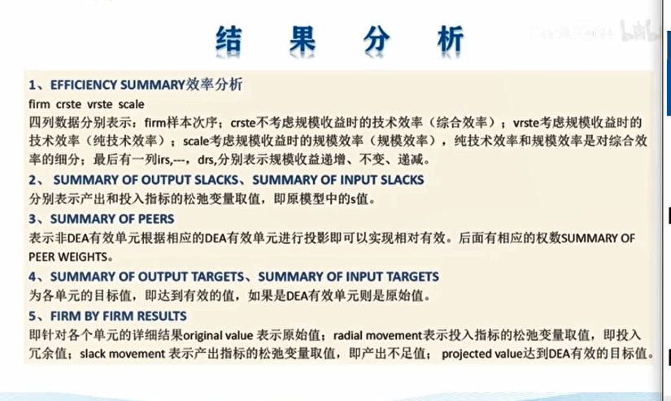

- 技术有效：输出相对输入而言已经最大，即该决策单元位于生产函数的曲线上
- 规模有效：投入量既不偏大，也不过小，是介于规模收入收益由递增到递减之间的状态，即处于规模收益不变的状态

生产函数$y=f(x)$是**生产处于最好的理想状态时，当投入量为X时所能获得的最大输出

## CCR模型的建立

n个决策单元，有m项输入，s项输出

- 输入向量：$X_i=(x_{i1},x_{i2},...,x_{im})$
- 输出向量：$Y_i=(y_{i1},y_{i2},...,y_{is})$
 
 用DEAP!!!!!

 